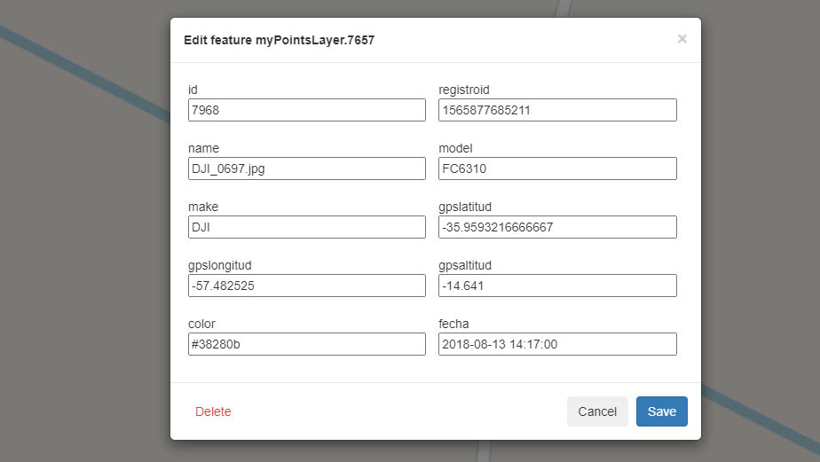

# OpenLayers WFST

<p align="center">
    <a href="https://www.npmjs.com/package/ol-wfst">
        
    </a>
    <a href="https://img.shields.io/npm/dm/ol-wfst">
        
    </a>
    <a href="https://github.com/gastonzalba/ol-wfst/blob/master/LICENSE">
        
    </a>
</p>

Tiny WFS-T client to insert (drawing/uploading), modify and delete features on GeoServers using [OpenLayers](https://openlayers.org/). Layers with these types of geometries are supported: *GeometryCollection* (in this case, you can choose the geometry type of each element to draw), *Point*, *MultiPoint*, *LineString*, *MultiLineString*, *Polygon* and *MultiPolygon*.

Tested with OpenLayers version 5, 6, 7 and 8.




## Usage

See [Wfst Options](#options) for more details.

```javascript
import Wfst, { Geoserver, WmsLayer, WfsLayer } from 'ol-wfst';
import { Fill, Stroke, Circle, Style } from 'ol/style';

// Style
import 'ol-wfst/lib/scss/ol-wfst.css';
import 'ol-wfst/lib/scss/ol-wfst.bootstrap5.css'; // Do not import if you already have boostrap css

// Optional credentials
const password = 123456;
const username = 'username';

const geoserver = {
    url: 'https://mysite.com/geoserver/myworkspace/ows',
    advanced: {
        getCapabilitiesVersion: '2.0.0',
        getFeatureVersion: '1.0.0',
        describeFeatureTypeVersion: '1.1.0',
        lockFeatureVersion: '1.1.0',
        projection: 'EPSG:3857'
    },
    // Maybe you wanna add this on a proxy, at the backend
    headers: { Authorization: 'Basic ' + btoa(username + ':' + password) }
};

const wfsLayer = new WfsLayer({
    name: 'myPointsLayer', // Name of the layer on the GeoServer
    label: 'Photos', // Optional Label to be displayed in the controller
    geoserver: geoserver,
    zIndex: 99,

    // WfsLayers need a custom style
    style: new Style({
        image: new Circle({
            radius: 7,
            fill: new Fill({
                color: '#000000'
            }),
            stroke: new Stroke({
                color: [255, 0, 0],
                width: 2
            })
        })
    }),

    // See [geoserverVendor](#geoservervendor) for more details.
    geoserverVendor: {
        cql_filter: 'id > 50',
        maxFeatures: 500
    },

    beforeTransactFeature: function (feature, transactionType) {
        if (transactionType === 'insert') {
            // Maybe add a custom value o perform an action before insert features
            feature.set('customProperty', 'customValue', true);
        } else if (transactionType === 'update') {
            // ... //
        } else if (transactionType === 'delete') {
            // .. //
        }

        return feature;
    }
});

const wmsLayer = new WmsLayer({
    name: 'myMultiGeometryLayer',
    label: 'Other elements',
    geoserver: geoserver,
    // See [geoserverVendor](#geoservervendor) for more details.
    geoserverVendor: {
        cql_filter: 'id > 50',
        buffer: 50,
        maxFeatures: 500
    },
    beforeTransactFeature: function (feature, transactionType) {
        if (transactionType === 'insert') {
            // Maybe add a custom value o perform an action before insert features
            feature.set('customProperty', 'customValue', true);
        } else if (transactionType === 'update') {
            // ... //
        } else if (transactionType === 'delete') {
            // .. //
        }

        return feature;
    }
});

const wfst = new Wfst({
    layers: [wfsLayer, wmsLayer],
    language: 'en',
    showUpload: true
});

map.addControl(wfst);
```

### Useful methods

See \[#wfsSource]

```js

wmsLayer.setCustomParam('cql_filter', `id = 28`);
wmsLayer.setCustomParam('env', `tags=true`);
```

### Adding features programatically

```js
const feature = new ol.Feature({
    geometry: new ol.geom.MultiPoint([[`-57.1145}`, `-36.2855`]])
});
const inserted = await myWmsLayer.insertFeatures([feature]);

if (inserted) {
    alert('Feature inserted');
} else {
    alert('Feature not inserted');
}
```

### Events

### wfst instance events

```js
wfst.on(
    ['modifystart', 'modifyend', 'drawstart', 'drawend', 'load', 'visible'],
    function (evt) {
        console.log(evt);
    }
);

wfst.on(['describeFeatureType'], function (evt) {
    console.log(evt.layer, evt.data);
});
```

### Geoserver events

```js
geoserver.on(['getCapabilities'], function (evt) {
    console.log(evt.data);
});
```

### Layers events

#### WMS Layer

```js
wmsLayer.on(['change:describeFeatureType'], function (evt) {
    console.log(evt);
});
```

Source [TileWMS Events](https://openlayers.org/en/latest/apidoc/module-ol_Object.ObjectEvent.html)

```js
wmsLayer.getSource().on([...])
```

#### WFS Layer

```js
wfsLayer.on(['change:describeFeatureType'], function (evt) {
    console.log(evt);
});
```

[VectorSource Events](https://openlayers.org/en/latest/apidoc/module-ol_source_Vector.VectorSourceEvent.html)

```js
wfsLayer.getSource().on([...])

```

### Some considerations

-   If the features/vertex appear to be slightly offset after adding them, check the _Number of Decimals_ in your Workplace, you may have to increment that to have a more accurete preview.
-   You can configure a _Basic Authentication_ or an _HTTP Header Proxy Authentication_ with this client, but in some cases is recommended setting that on an reverse proxy on the backend.
-   If you don't use a reverse proxy, remeber configure [cors](https://docs.geoserver.org/latest/en/user/production/container.html#enable-cors)

## Changelog

See [CHANGELOG](./CHANGELOG.md) for details of changes in each release.

## Install

### Browser

#### JS

Load `ol-wfst.js` after OpenLayers. The available classes are `Wfst`, `Wfst.Geoserver`, `Wfst.WfsLayer` and `Wfst.WmsLayer`.

```HTML
<script src="https://unpkg.com/ol-wfst@4.2.0"></script>
```

#### CSS

```HTML
<link rel="stylesheet" href="https://unpkg.com/ol-wfst@4.2.0/dist/css/ol-wfst.min.css" />
<link rel="stylesheet" href="https://unpkg.com/ol-wfst@4.2.0/dist/css/ol-wfst.bootstrap5.min.css" />
```

### Parcel, Webpack, etc.

NPM package: [ol-wfst](https://www.npmjs.com/package/ol-wfst).

Install the package via `npm`

    npm install ol-wfst

#### JS

```js
import Wfst, { Geoserver, WmsLayer, WfsLayer } from 'ol-wfst';
```

#### CSS

```js
// scss
import 'ol-wfst/lib/style/scss/ol-wfst.scss';
import 'ol-wfst/lib/style/scss/-ol-wfst.bootstrap5.scss';

// or css
import 'ol-wfst/lib/style/css/ol-wfst.css';
import 'ol-wfst/lib/style/css/ol-wfst.bootstrap5.css';
```

#### TypeScript type definition

TypeScript types are shipped with the project in the dist directory and should be automatically used in a TypeScript project. Interfaces are provided for Wfst Options.

## API

<!-- Generated by documentation.js. Update this documentation by updating the source code. -->

#### Table of Contents

-   [BaseGeoserverVendor](#basegeoservervendor)
    -   [key](#key)
    -   [cql_filter](#cql_filter)
    -   [sortBy](#sortby)
    -   [featureid](#featureid)
    -   [filter](#filter)
    -   [format_options](#format_options)
    -   [maxFeatures](#maxfeatures)
    -   [startIndex](#startindex)
    -   [propertyname](#propertyname)
-   [Wfst](#wfst)
    -   [Parameters](#parameters)
    -   [getLayers](#getlayers)
    -   [getLayerByName](#getlayerbyname)
        -   [Parameters](#parameters-1)
    -   [activateDrawMode](#activatedrawmode)
        -   [Parameters](#parameters-2)
    -   [activateEditMode](#activateeditmode)
        -   [Parameters](#parameters-3)
-   [Geoserver](#geoserver)
    -   [Parameters](#parameters-4)
    -   [getCapabilities](#getcapabilities)
    -   [getParsedCapabilities](#getparsedcapabilities)
    -   [setUrl](#seturl)
        -   [Parameters](#parameters-5)
    -   [getUrl](#geturl)
    -   [setHeaders](#setheaders)
        -   [Parameters](#parameters-6)
    -   [getHeaders](#getheaders)
    -   [setCredentials](#setcredentials)
        -   [Parameters](#parameters-7)
    -   [getCredentials](#getcredentials)
    -   [setAdvanced](#setadvanced)
        -   [Parameters](#parameters-8)
    -   [getAdvanced](#getadvanced)
    -   [hasTransaction](#hastransaction)
    -   [hasLockFeature](#haslockfeature)
    -   [getUseLockFeature](#getuselockfeature)
    -   [setUseLockFeature](#setuselockfeature)
        -   [Parameters](#parameters-9)
    -   [isLoaded](#isloaded)
    -   [getState](#getstate)
    -   [getAndUpdateCapabilities](#getandupdatecapabilities)
    -   [\_removeFeatures](#_removefeatures)
        -   [Parameters](#parameters-10)
    -   [lockFeature](#lockfeature)
        -   [Parameters](#parameters-11)
-   [WfsLayer](#wfslayer)
    -   [Parameters](#parameters-12)
    -   [refresh](#refresh)
    -   [setCustomParam](#setcustomparam)
        -   [Parameters](#parameters-13)
-   [WmsLayer](#wmslayer)
    -   [Parameters](#parameters-14)
    -   [refresh](#refresh-1)
    -   [setCustomParam](#setcustomparam-1)
        -   [Parameters](#parameters-15)
-   [Options](#options)
    -   [processUpload](#processupload)
        -   [Parameters](#parameters-16)
    -   [layers](#layers)
    -   [active](#active)
    -   [evtType](#evttype)
    -   [showControl](#showcontrol)
    -   [modal](#modal)
    -   [language](#language)
    -   [i18n](#i18n)
    -   [showUpload](#showupload)
    -   [uploadFormats](#uploadformats)
-   [LayerOptions](#layeroptions)
    -   [beforeTransactFeature](#beforetransactfeature)
        -   [Parameters](#parameters-17)
    -   [name](#name)
    -   [geoserver](#geoserver-1)
    -   [label](#label)
    -   [geoserverVendor](#geoservervendor)
    -   [strategy](#strategy)
-   [GeoserverOptions](#geoserveroptions)
    -   [url](#url)
    -   [advanced](#advanced)
    -   [headers](#headers)
    -   [credentials](#credentials)
    -   [useLockFeature](#uselockfeature)
-   [GeoServerAdvanced](#geoserveradvanced)
-   [WfsGeoserverVendor](#wfsgeoservervendor)
    -   [strict](#strict)
-   [WmsGeoserverVendor](#wmsgeoservervendor)
    -   [buffer](#buffer)
    -   [env](#env)
    -   [clip](#clip)
    -   [styles](#styles)
    -   [transparent](#transparent)
    -   [bgcolor](#bgcolor)
    -   [time](#time)
    -   [sld](#sld)
    -   [sld_body](#sld_body)
-   [IGeoserverDescribeFeatureType](#igeoserverdescribefeaturetype)
    -   [\_parsed](#_parsed)
-   [I18n](#i18n-1)
    -   [labels](#labels)
    -   [errors](#errors)

### BaseGeoserverVendor

#### key

Add any other param

#### cql_filter

<https://docs.geoserver.org/latest/en/user/services/wms/vendor.html#cql-filter>

Type: [string](https://developer.mozilla.org/docs/Web/JavaScript/Reference/Global_Objects/String)

#### sortBy

<https://docs.geoserver.org/latest/en/user/services/wms/vendor.html#sortBy>

Type: [string](https://developer.mozilla.org/docs/Web/JavaScript/Reference/Global_Objects/String)

#### featureid

<https://docs.geoserver.org/latest/en/user/services/wms/vendor.html#featureid>

Type: [string](https://developer.mozilla.org/docs/Web/JavaScript/Reference/Global_Objects/String)

#### filter

<https://docs.geoserver.org/latest/en/user/services/wms/vendor.html#filter>

Type: [string](https://developer.mozilla.org/docs/Web/JavaScript/Reference/Global_Objects/String)

#### format_options

WMS: <https://docs.geoserver.org/latest/en/user/services/wms/vendor.html#format-options>
WFS: <https://docs.geoserver.org/latest/en/user/services/wfs/vendor.html#format-options>

Type: [string](https://developer.mozilla.org/docs/Web/JavaScript/Reference/Global_Objects/String)

#### maxFeatures

<https://docs.geoserver.org/latest/en/user/services/wms/vendor.html#maxfeatures-and-startindex>

Type: ([string](https://developer.mozilla.org/docs/Web/JavaScript/Reference/Global_Objects/String) | [number](https://developer.mozilla.org/docs/Web/JavaScript/Reference/Global_Objects/Number))

#### startIndex

<https://docs.geoserver.org/latest/en/user/services/wms/vendor.html#maxfeatures-and-startindex>

Type: ([string](https://developer.mozilla.org/docs/Web/JavaScript/Reference/Global_Objects/String) | [number](https://developer.mozilla.org/docs/Web/JavaScript/Reference/Global_Objects/Number))

#### propertyname

<https://docs.geoserver.org/latest/en/user/services/wms/vendor.html#propertyname>

Type: [string](https://developer.mozilla.org/docs/Web/JavaScript/Reference/Global_Objects/String)

### Wfst

**Extends ol/control/[Control](https://openlayers.org/en/latest/apidoc/module-ol_control_Control-Control.html)~[Control](https://openlayers.org/en/latest/apidoc/module-ol_control_Control-Control.html)**

Tiny WFST-T client to insert (drawing/uploading), modify and delete
features on GeoServers using OpenLayers. Layers with these types
of geometries are supported: "GeometryCollection" (in this case, you can
choose the geometry type of each element to draw), "Point", "MultiPoint",
"LineString", "MultiLineString", "Polygon" and "MultiPolygon".

#### Parameters

-   `options` **[Options](#options)?** Wfst options, see [Wfst Options](#options) for more details.

#### getLayers

Get all the layers in the ol-wfst instance

Returns **[Array](https://developer.mozilla.org/docs/Web/JavaScript/Reference/Global_Objects/Array)<([WfsLayer](#wfslayer) | [WmsLayer](#wmslayer))>**&#x20;

#### getLayerByName

Get a layer

##### Parameters

-   `layerName` (optional, default `''`)

Returns **([WfsLayer](#wfslayer) | [WmsLayer](#wmslayer))**&#x20;

#### activateDrawMode

Activate/deactivate the draw mode

##### Parameters

-   `layer` **([WfsLayer](#wfslayer) | [WmsLayer](#wmslayer) | `false`)**&#x20;

Returns **void**&#x20;

#### activateEditMode

Activate/desactivate the edit mode

##### Parameters

-   `bool` (optional, default `true`)

Returns **void**&#x20;

### Geoserver

**Extends ol/Object~[BaseObject](https://openlayers.org/en/latest/apidoc/module-ol_Object-BaseObject.html)**

#### Parameters

-   `options` **[GeoserverOptions](#geoserveroptions)**&#x20;

#### getCapabilities

Returns **XMLDocument**&#x20;

#### getParsedCapabilities

Only work for `2.0.0` getCapabilities version

Returns **any**&#x20;

#### setUrl

##### Parameters

-   `url` **[string](https://developer.mozilla.org/docs/Web/JavaScript/Reference/Global_Objects/String)**&#x20;
-   `opt_silent` (optional, default `false`)

Returns **void**&#x20;

#### getUrl

Returns **[string](https://developer.mozilla.org/docs/Web/JavaScript/Reference/Global_Objects/String)**&#x20;

#### setHeaders

##### Parameters

-   `headers` **HeadersInit** (optional, default `{}`)
-   `opt_silent` (optional, default `false`)

Returns **void**&#x20;

#### getHeaders

Returns **HeadersInit**&#x20;

#### setCredentials

##### Parameters

-   `credentials` **RequestCredentials** (optional, default `null`)
-   `opt_silent` (optional, default `false`)

Returns **void**&#x20;

#### getCredentials

Returns **RequestCredentials**&#x20;

#### setAdvanced

##### Parameters

-   `advanced` **[GeoServerAdvanced](#geoserveradvanced)** (optional, default `{}`)
-   `opt_silent` (optional, default `false`)

Returns **void**&#x20;

#### getAdvanced

Returns **[GeoServerAdvanced](#geoserveradvanced)**&#x20;

#### hasTransaction

Returns **[boolean](https://developer.mozilla.org/docs/Web/JavaScript/Reference/Global_Objects/Boolean)**&#x20;

#### hasLockFeature

Returns **[boolean](https://developer.mozilla.org/docs/Web/JavaScript/Reference/Global_Objects/Boolean)**&#x20;

#### getUseLockFeature

Returns **[boolean](https://developer.mozilla.org/docs/Web/JavaScript/Reference/Global_Objects/Boolean)**&#x20;

#### setUseLockFeature

##### Parameters

-   `useLockFeature` **[boolean](https://developer.mozilla.org/docs/Web/JavaScript/Reference/Global_Objects/Boolean)**&#x20;
-   `opt_silent` (optional, default `false`)

Returns **void**&#x20;

#### isLoaded

Returns **[boolean](https://developer.mozilla.org/docs/Web/JavaScript/Reference/Global_Objects/Boolean)**&#x20;

#### getState

#### getAndUpdateCapabilities

Get the capabilities from the GeoServer and check
all the available operations.

Returns **[Promise](https://developer.mozilla.org/docs/Web/JavaScript/Reference/Global_Objects/Promise)\<XMLDocument>**&#x20;

#### \_removeFeatures

##### Parameters

-   `features` **[Array](https://developer.mozilla.org/docs/Web/JavaScript/Reference/Global_Objects/Array)\<Feature\<Geometry>>**&#x20;

#### lockFeature

Lock a feature in the geoserver. Useful before editing a geometry,
to avoid changes from multiples suers

##### Parameters

-   `featureId` **([string](https://developer.mozilla.org/docs/Web/JavaScript/Reference/Global_Objects/String) | [number](https://developer.mozilla.org/docs/Web/JavaScript/Reference/Global_Objects/Number))**&#x20;
-   `layerName` **[string](https://developer.mozilla.org/docs/Web/JavaScript/Reference/Global_Objects/String)**&#x20;
-   `retry` (optional, default `0`)

Returns **[Promise](https://developer.mozilla.org/docs/Web/JavaScript/Reference/Global_Objects/Promise)<[string](https://developer.mozilla.org/docs/Web/JavaScript/Reference/Global_Objects/String)>**&#x20;

### WfsLayer

**Extends ol/layer/Vector~[VectorLayer](https://openlayers.org/en/latest/apidoc/module-ol_layer_Vector-VectorLayer.html)**

Layer to retrieve WFS features from geoservers
<https://docs.geoserver.org/stable/en/user/services/wfs/reference.html>

#### Parameters

-   `options` **[LayerOptions](#layeroptions)**&#x20;

#### refresh

#### setCustomParam

Use this to update Geoserver Wms Vendors (<https://docs.geoserver.org/latest/en/user/services/wms/vendor.html>)
and other arguements (<https://docs.geoserver.org/stable/en/user/services/wms/reference.html#getmap>)
in all the getMap requests.

Example: you can use this to change the style of the WMS, add a custom sld, set a cql_filter, etc.

##### Parameters

-   `paramName` **[string](https://developer.mozilla.org/docs/Web/JavaScript/Reference/Global_Objects/String)**&#x20;
-   `value` **[string](https://developer.mozilla.org/docs/Web/JavaScript/Reference/Global_Objects/String)** Use `undefined` or `null` to remove the param (optional, default `null`)
-   `refresh` (optional, default `true`)

Returns **URLSearchParams**&#x20;

### WmsLayer

**Extends ol/layer/Tile~[TileLayer](https://openlayers.org/en/latest/apidoc/module-ol_layer_Tile-TileLayer.html)**

Layer to retrieve WMS information from geoservers
<https://docs.geoserver.org/stable/en/user/services/wms/reference.html>

#### Parameters

-   `options` **[LayerOptions](#layeroptions)**&#x20;

#### refresh

#### setCustomParam

Use this to update Geoserver Wfs Vendors (<https://docs.geoserver.org/latest/en/user/services/wfs/vendor.html>)
and other arguements (<https://docs.geoserver.org/stable/en/user/services/wfs/reference.html>)
in all the getFeature requests.

Example: you can use this to set a cql_filter, limit the numbers of features, etc.

##### Parameters

-   `paramName` **[string](https://developer.mozilla.org/docs/Web/JavaScript/Reference/Global_Objects/String)**&#x20;
-   `value` **[string](https://developer.mozilla.org/docs/Web/JavaScript/Reference/Global_Objects/String)** (optional, default `null`)
-   `refresh` (optional, default `true`)

Returns **URLSearchParams**&#x20;

### Options

**_\[interface]_** - Wfst Options specified when creating a Wfst instance

Default values:

```javascript
{
 layers: null,
 evtType: 'singleclick',
 active: true,
 showControl: true,
 language: 'en',
 i18n: {...}, // according to language selection
 uploadFormats: '.geojson,.json,.kml',
 processUpload: null,
}
```

#### processUpload

Triggered to allow implement custom functions or to parse other formats than default
by filtering the extension. If this doesn't return features, the default function
will be used to extract them.

##### Parameters

-   `file` **File**&#x20;

Returns **[Array](https://developer.mozilla.org/docs/Web/JavaScript/Reference/Global_Objects/Array)\<Feature\<Geometry>>**&#x20;

#### layers

Layers to be loaded from the geoserver

Type: [Array](https://developer.mozilla.org/docs/Web/JavaScript/Reference/Global_Objects/Array)<([WfsLayer](#wfslayer) | [WmsLayer](#wmslayer))>

#### active

Init active

Type: [boolean](https://developer.mozilla.org/docs/Web/JavaScript/Reference/Global_Objects/Boolean)

#### evtType

The click event to allow selection of Features to be edited

Type: (`"singleclick"` | `"dblclick"`)

#### showControl

Show/hide the control map

Type: [boolean](https://developer.mozilla.org/docs/Web/JavaScript/Reference/Global_Objects/Boolean)

#### modal

Modal configuration

Type: {animateClass: [string](https://developer.mozilla.org/docs/Web/JavaScript/Reference/Global_Objects/String)?, animateInClass: [string](https://developer.mozilla.org/docs/Web/JavaScript/Reference/Global_Objects/String)?, transition: [number](https://developer.mozilla.org/docs/Web/JavaScript/Reference/Global_Objects/Number)?, backdropTransition: [number](https://developer.mozilla.org/docs/Web/JavaScript/Reference/Global_Objects/Number)?, templates: {dialog: ([string](https://developer.mozilla.org/docs/Web/JavaScript/Reference/Global_Objects/String) | [HTMLElement](https://developer.mozilla.org/docs/Web/HTML/Element))?, headerClose: ([string](https://developer.mozilla.org/docs/Web/JavaScript/Reference/Global_Objects/String) | [HTMLElement](https://developer.mozilla.org/docs/Web/HTML/Element))?}?}

#### language

Language to be used

Type: (`"es"` | `"en"` | `"zh"`)

#### i18n

Custom translations

Type: [I18n](#i18n)

#### showUpload

Show/hide the upload button

Type: [boolean](https://developer.mozilla.org/docs/Web/JavaScript/Reference/Global_Objects/Boolean)

#### uploadFormats

Accepted extension formats on upload
Example: ".json,.geojson"

Type: [string](https://developer.mozilla.org/docs/Web/JavaScript/Reference/Global_Objects/String)

### LayerOptions

**Extends Omit\<[VectorLayerOptions](https://openlayers.org/en/latest/apidoc/module-ol_layer_Vector-VectorLayer.html)\<any>, 'source'>**

**_\[interface]_** - Parameters to create the layers and connect to the GeoServer

You can use all the parameters supported by OpenLayers

Default values:

```javascript
{
 name: null,
 geoserver: null,
 label: null, // `name` if not provided
 strategy: all,
 geoserverVendor: null
}
```

#### beforeTransactFeature

Triggered before inserting new features to the Geoserver.
Use this to insert custom properties, modify the feature, etc.

##### Parameters

-   `feature` **Feature\<Geometry>**&#x20;
-   `transaction` **TransactionType**&#x20;

Returns **Feature\<Geometry>**&#x20;

#### name

Layer name in the GeoServer

Type: [string](https://developer.mozilla.org/docs/Web/JavaScript/Reference/Global_Objects/String)

#### geoserver

Geoserver Object

Type: [Geoserver](#geoserver)

#### label

Label to be displayed in the widget control

Type: [string](https://developer.mozilla.org/docs/Web/JavaScript/Reference/Global_Objects/String)

#### geoserverVendor

Available geoserver options

Type: ([WfsGeoserverVendor](#wfsgeoservervendor) | [WmsGeoserverVendor](#wmsgeoservervendor))

#### strategy

Strategy function for loading features.
Only for WFS
By default `all` strategy is used

Type: LoadingStrategy

### GeoserverOptions

**_\[interface]_**

#### url

Url for OWS services. This endpoint will recive the WFS, WFST and WMS requests

Type: [string](https://developer.mozilla.org/docs/Web/JavaScript/Reference/Global_Objects/String)

#### advanced

Advanced options for geoserver requests

Type: [GeoServerAdvanced](#geoserveradvanced)

#### headers

Http headers for GeoServer requests
<https://developer.mozilla.org/en-US/docs/Web/API/Request/headers>

Type: HeadersInit

#### credentials

Credentials for fetch requests
<https://developer.mozilla.org/en-US/docs/Web/API/Request/credentials>

Default is 'same-origin'

Type: RequestCredentials

#### useLockFeature

Use LockFeatue request on GeoServer when selecting features. Prevents a feature from being edited
through a persistent feature lock. This is not always supportedd by the GeoServer.
See <https://docs.geoserver.org/stable/en/user/services/wfs/reference.html>

Type: [boolean](https://developer.mozilla.org/docs/Web/JavaScript/Reference/Global_Objects/Boolean)

### GeoServerAdvanced

**_\[interface]_**

-   Default values:

```javascript
{
  getCapabilitiesVersion: '2.0.0',
  getFeatureVersion: '1.0.0',
  describeFeatureTypeVersion: '1.1.0',
  lockFeatureVersion: '1.1.0',
  wfsTransactionVersion: '1.1.0',
  projection: 'EPSG:3857',
  lockFeatureParams: {
    expiry: 5,
    lockId: 'Geoserver',
    releaseAction: 'SOME'
  }
}
```

### WfsGeoserverVendor

**Extends BaseGeoserverVendor**

**_\[interface]_** - WFS geoserver options
<https://docs.geoserver.org/latest/en/user/services/wfs/vendor.html>

#### strict

<https://docs.geoserver.org/latest/en/user/services/wfs/vendor.html#xml-request-validation>

Type: [boolean](https://developer.mozilla.org/docs/Web/JavaScript/Reference/Global_Objects/Boolean)

### WmsGeoserverVendor

**Extends BaseGeoserverVendor**

**_\[interface]_** - WMS geoserver options
<https://docs.geoserver.org/latest/en/user/services/wms/vendor.html>

#### buffer

<https://docs.geoserver.org/latest/en/user/services/wms/vendor.html#buffer>

Type: ([string](https://developer.mozilla.org/docs/Web/JavaScript/Reference/Global_Objects/String) | [number](https://developer.mozilla.org/docs/Web/JavaScript/Reference/Global_Objects/Number))

#### env

<https://docs.geoserver.org/latest/en/user/services/wms/vendor.html#env>

Type: [string](https://developer.mozilla.org/docs/Web/JavaScript/Reference/Global_Objects/String)

#### clip

<https://docs.geoserver.org/latest/en/user/services/wms/vendor.html#clip>

Type: [string](https://developer.mozilla.org/docs/Web/JavaScript/Reference/Global_Objects/String)

#### styles

Styles in which layers are to be rendered.
Value is a comma-separated list of style names, or empty if default styling is required.
Style names may be empty in the list, to use default layer styling.

Type: [string](https://developer.mozilla.org/docs/Web/JavaScript/Reference/Global_Objects/String)

#### transparent

Whether the map background should be transparent. Values are true or false. Default is false

Type: [boolean](https://developer.mozilla.org/docs/Web/JavaScript/Reference/Global_Objects/Boolean)

#### bgcolor

Background color for the map image. Value is in the form RRGGBB. Default is FFFFFF (white).

Type: [string](https://developer.mozilla.org/docs/Web/JavaScript/Reference/Global_Objects/String)

#### time

Time value or range for map data.
See [Time Support in GeoServer WMS](https://docs.geoserver.org/stable/en/user/services/wms/time.html#wms-time) for more information.

Type: [string](https://developer.mozilla.org/docs/Web/JavaScript/Reference/Global_Objects/String)

#### sld

A URL referencing a [StyledLayerDescriptor](https://docs.geoserver.org/stable/en/user/styling/index.html#styling)
XML file which controls or enhances map layers and styling

Type: [string](https://developer.mozilla.org/docs/Web/JavaScript/Reference/Global_Objects/String)

#### sld_body

A URL-encoded StyledLayerDescriptor XML document which controls or enhances map layers and styling

Type: [string](https://developer.mozilla.org/docs/Web/JavaScript/Reference/Global_Objects/String)

### IGeoserverDescribeFeatureType

**_\[interface]_** - Geoserver original response on DescribeFeature request

#### \_parsed

DescribeFeature request parsed

Type: {namespace: [string](https://developer.mozilla.org/docs/Web/JavaScript/Reference/Global_Objects/String), properties: any, geomType: GeometryType, geomField: [string](https://developer.mozilla.org/docs/Web/JavaScript/Reference/Global_Objects/String)}

### I18n

**_\[interface]_** - Custom Language specified when creating a WFST instance

#### labels

Labels section

Type: {select: [string](https://developer.mozilla.org/docs/Web/JavaScript/Reference/Global_Objects/String)?, addElement: [string](https://developer.mozilla.org/docs/Web/JavaScript/Reference/Global_Objects/String)?, editElement: [string](https://developer.mozilla.org/docs/Web/JavaScript/Reference/Global_Objects/String)?, save: [string](https://developer.mozilla.org/docs/Web/JavaScript/Reference/Global_Objects/String)?, delete: [string](https://developer.mozilla.org/docs/Web/JavaScript/Reference/Global_Objects/String)?, cancel: [string](https://developer.mozilla.org/docs/Web/JavaScript/Reference/Global_Objects/String)?, apply: [string](https://developer.mozilla.org/docs/Web/JavaScript/Reference/Global_Objects/String)?, upload: [string](https://developer.mozilla.org/docs/Web/JavaScript/Reference/Global_Objects/String)?, editMode: [string](https://developer.mozilla.org/docs/Web/JavaScript/Reference/Global_Objects/String)?, confirmDelete: [string](https://developer.mozilla.org/docs/Web/JavaScript/Reference/Global_Objects/String)?, geomTypeNotSupported: [string](https://developer.mozilla.org/docs/Web/JavaScript/Reference/Global_Objects/String)?, editFields: [string](https://developer.mozilla.org/docs/Web/JavaScript/Reference/Global_Objects/String)?, editGeom: [string](https://developer.mozilla.org/docs/Web/JavaScript/Reference/Global_Objects/String)?, selectDrawType: [string](https://developer.mozilla.org/docs/Web/JavaScript/Reference/Global_Objects/String)?, uploadToLayer: [string](https://developer.mozilla.org/docs/Web/JavaScript/Reference/Global_Objects/String)?, uploadFeatures: [string](https://developer.mozilla.org/docs/Web/JavaScript/Reference/Global_Objects/String)?, validFeatures: [string](https://developer.mozilla.org/docs/Web/JavaScript/Reference/Global_Objects/String)?, invalidFeatures: [string](https://developer.mozilla.org/docs/Web/JavaScript/Reference/Global_Objects/String)?, loading: [string](https://developer.mozilla.org/docs/Web/JavaScript/Reference/Global_Objects/String)?, toggleVisibility: [string](https://developer.mozilla.org/docs/Web/JavaScript/Reference/Global_Objects/String)?, close: [string](https://developer.mozilla.org/docs/Web/JavaScript/Reference/Global_Objects/String)?}

#### errors

Errors section

Type: {capabilities: [string](https://developer.mozilla.org/docs/Web/JavaScript/Reference/Global_Objects/String)?, wfst: [string](https://developer.mozilla.org/docs/Web/JavaScript/Reference/Global_Objects/String)?, layer: [string](https://developer.mozilla.org/docs/Web/JavaScript/Reference/Global_Objects/String)?, layerNotFound: [string](https://developer.mozilla.org/docs/Web/JavaScript/Reference/Global_Objects/String)?, layerNotVisible: [string](https://developer.mozilla.org/docs/Web/JavaScript/Reference/Global_Objects/String)?, noValidGeometry: [string](https://developer.mozilla.org/docs/Web/JavaScript/Reference/Global_Objects/String)?, geoserver: [string](https://developer.mozilla.org/docs/Web/JavaScript/Reference/Global_Objects/String)?, badFormat: [string](https://developer.mozilla.org/docs/Web/JavaScript/Reference/Global_Objects/String)?, badFile: [string](https://developer.mozilla.org/docs/Web/JavaScript/Reference/Global_Objects/String)?, lockFeature: [string](https://developer.mozilla.org/docs/Web/JavaScript/Reference/Global_Objects/String)?, transaction: [string](https://developer.mozilla.org/docs/Web/JavaScript/Reference/Global_Objects/String)?, getFeatures: [string](https://developer.mozilla.org/docs/Web/JavaScript/Reference/Global_Objects/String)?}

## TODO

*   ~~Add support to diferent layer styles~~
*   ~~Improve widget controller: visibility toggle~~
*   ~~Add events~~
*   Add `Don't show again` option in the error modal
*   Allow selection of multiples features and bulk edit
*   Add customizables styles
*   Improve scss (add variables)
*   Add cookies to persist widget controller state
*   Geometry type *LinearRing* support
*   Tests!
*   Improve comments and documentation
*   Improve interface
*   Change svg imports to preserve svg structure
*   Improve style on editing and drawing features
